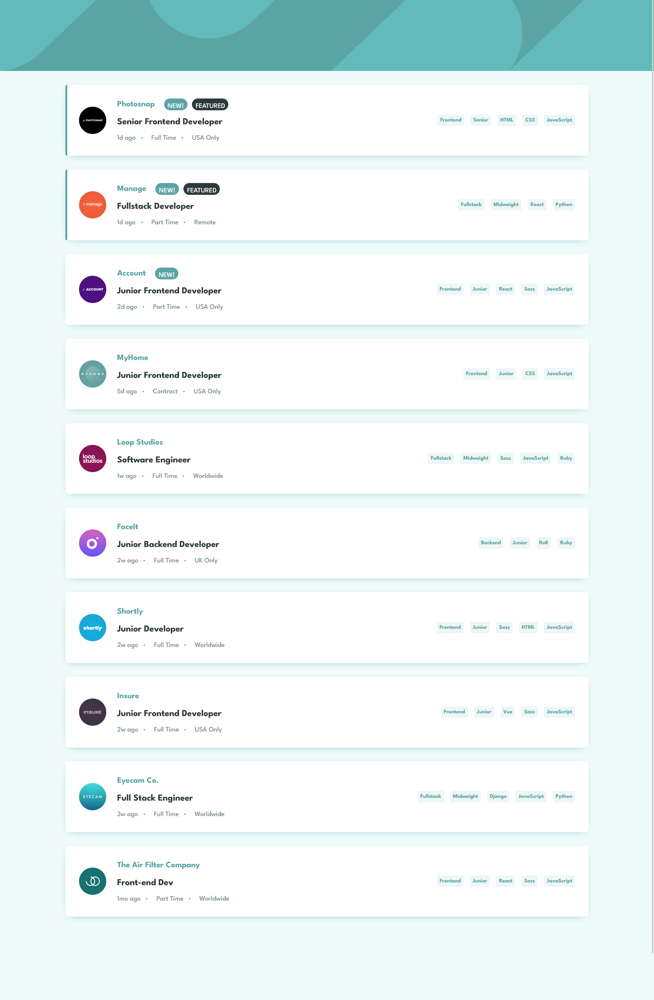
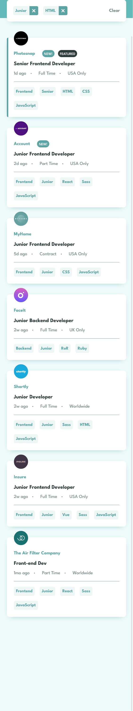

# Frontend Mentor - Job listings with filtering solution

This is a solution to the [Job listings with filtering challenge on Frontend Mentor](https://www.frontendmentor.io/challenges/job-listings-with-filtering-ivstIPCt). Frontend Mentor challenges help you improve your coding skills by building realistic projects. 

## Table of contents
- [Overview](#overview)
  - [The challenge](#the-challenge)
  - [Screenshot](#screenshot)
  - [Links](#links)
- [My process](#my-process)
  - [Built with](#built-with)
- [Author](#author)

## Overview

### The challenge

Users should be able to:

- View the optimal layout for the site depending on their device's screen size
- See hover states for all interactive elements on the page
- Filter job listings based on the categories

### Screenshot

### Links
- Solution URL: [Click to view Solution](https://www.frontendmentor.io/solutions/time-tracking-dashboard-solution-using-css-grid-MX_ntr65HI)
- Live Site URL: [Click to view Live Site](https://coded-by-mj.github.io/Front-end-Mentor-Challenge15/)

## My process

### Built with
- Semantic HTML5 markup
- CSS 
- Flexbox
- JQuery
- API
- JSON
- Mobile First Workflow

## Author
- Frontend Mentor - [@Coded-by-MJ](https://www.frontendmentor.io/profile/Coded-by-MJ)
- Twitter - [@MiracleJustice_](https://twitter.com/miraclejustice_)